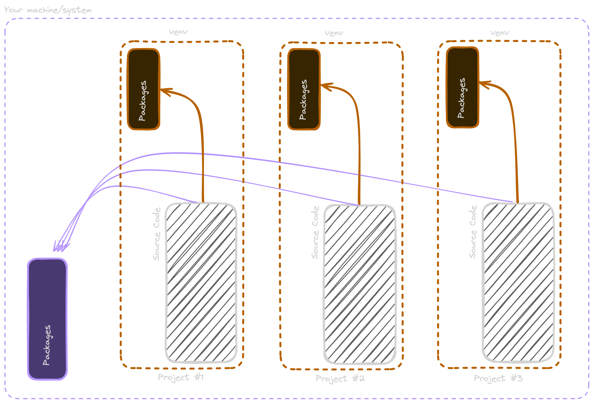

# pdm-demo

This is a PDM (Python Dependency Manager) based solution that does NOT use Python virtual environments to install, develop, and deploy a single binary executable Python API service.

This is a basic example of how we could build a Python API without virtual environments that can be built into a single executable that can be embedded in whatever we want (like a Docker container, for example) and delivered to a client as a deliverable.

---

## Technologies

- [PDM](https://pdm-project.org/latest/)
- [Fast API](https://fastapi.tiangolo.com/)
- [PyInstaller](https://pyinstaller.org/en/stable/)

---

## Required Before Starting

- [PDM](https://pdm-project.org/latest/)
- Python 3.11 or greater

---

## Quick Start

| Order | Command       | Description                     |
| :---- | :------------ | :------------------------------ |
| 1     | `pdm install` | Installs all your dependencies. |
| 2     | `pdm start`   | Starts the development server.  |

---

## Build/Preview Commands

| Command         | Description                         |
| :-------------- | :---------------------------------- |
| `pdm run build` | Builds the single-execution binary. |

---

## API Documentation Links

1. [Redoc](http://127.0.0.1:8000/redoc)
   1. http://127.0.0.1:8000/redoc
2. [Swagger](http://127.0.0.1:8000/docs)
   1. http://127.0.0.1:8000/docs

---

## What are Python Virutal Environments?

Python virtual environments ("venv", for short) are isolated `chroot`-like environments that isolate the package instllation that Python package managers do by scoping it down into a smaller global scope. For example, if a Python package is installed normally, it is always globally installed. However, as working with more than one project goes, it is possible to end up with several versions of the same packages. This is not ideal and creates extra data consumption from the underlying system and makes it hard to guarentee what version of packages are being used at any given point during development. Venv attempts to fix this by scoping down the global environment to just the project the code lives in.

Here in this example, the purple lines represent where packages inside projects go when there is NOT an active virtual environment. The orange lines represent where packages go when there is an active virutal environment.

The things people do not like about virtual environments is that you have to build up the natural muscle memory to remember to "activate" and "deactivate" these virutal environments. Enter [PDM](https://pdm-project.org/latest/), a solution that tries to take the fundamental concept of `node_modules` and allow Python to be able to function similarly where packages live locally within the project without the need to use a virtual environment to run them.

Though some folks might not like the idea of another `node_modules` like system. There is no real way to argue against the benefits of being able to isolate packages without having to manage a virtual environment. PDM is the ultimate result of taking virtual environments to their ultimate conclusion; abstract it out of the development lifecycle.